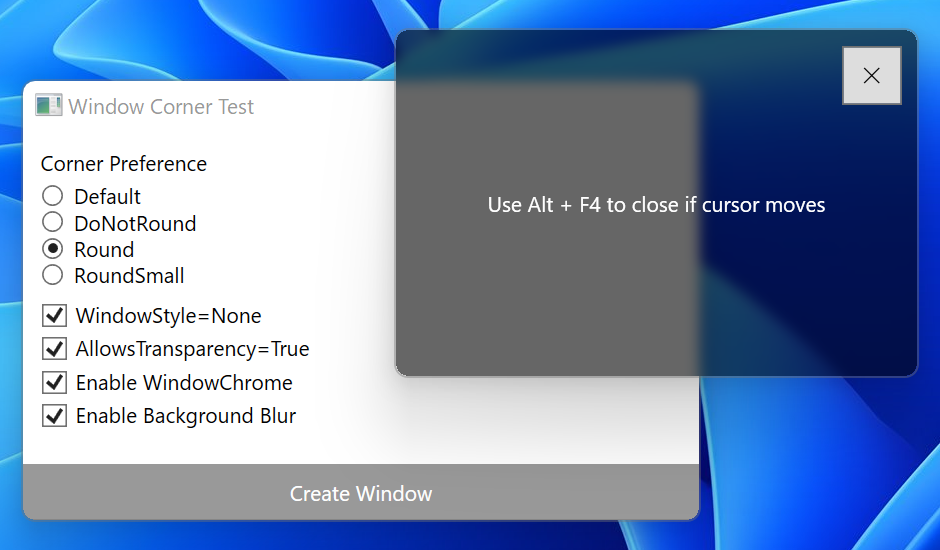
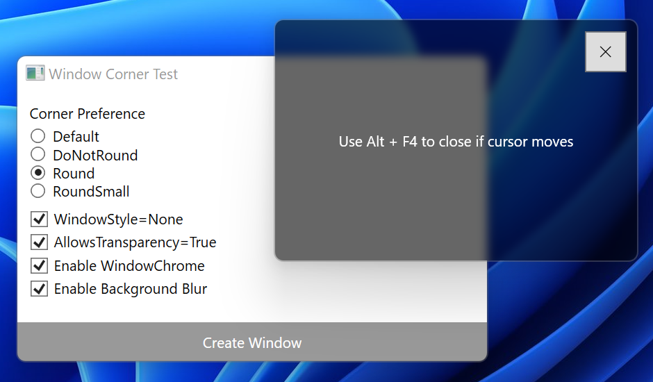

# Window Corner Test

Rounded corners of window on Windows 11 applicable to WPF.

## Requirements

- .NET 5.0
- Windows 11 (10.0.22000.x)

## Overview

To work with rounded corners introduced in Windows 11, check the official explanation on this feature.

- [Apply rounded corners in desktop apps for Windows 11](https://docs.microsoft.com/en-us/windows/apps/desktop/modernize/apply-rounded-corners)

(This document is dated on 10/02/2020 but actually it was committed on 07/17/2021.)

The underlying values of key constants, `DWMWA_WINDOW_CORNER_PREFERENCE` and `DWM_WINDOW_CORNER_PREFERENCE` enumeration, can be found in dwmapi.h included in Windows Insider Preview SDK.

When rounded corners are applied to a window, a gray outline is automatically added.

On version 10.0.22000.__100__, anti-aliasing is not applied to the rounded corners and they show noticeable jaggies (except those of standard title bar).

 
(DPI: 175%)

On version 10.0.22000.__120__, anti-aliasing is applied and the jaggies are fixed.

